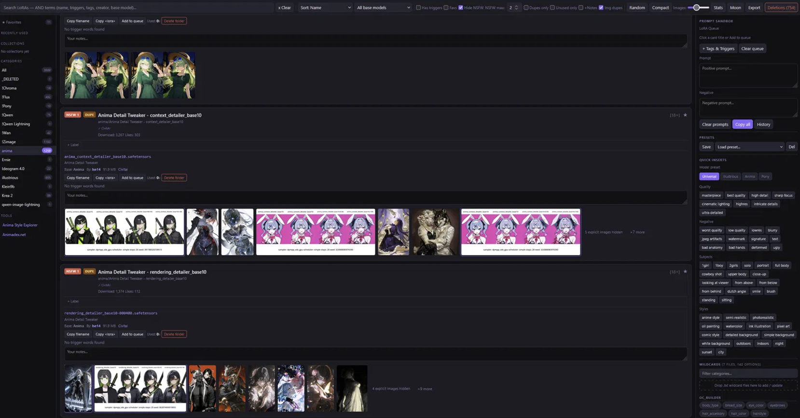

# Local LORA Gallery Creator



A **Python-based static site generator** that creates a fast, searchable **local HTML gallery** for browsing your Stable Diffusion LoRAs — complete with **image previews, trigger words, metadata, filters, notes, favorites, and presets**.

This tool is designed for people with **large LoRA collections** who want to explore, compare, and select styles **outside of their SD UI** (ComfyUI, A1111, etc.).

I primary made this for my own personal use. I don't know if I will make any improvements to what I already have. 

---

## ✨ Features

- 📁 Scans your LoRA folder structure automatically
- 🖼️ Displays **image previews** saved with each model
- 🔑 Extracts **trigger words** from Civitai metadata
- 🔍 Powerful search:
  - LoRA name
  - trigger words
  - tags & normalized tags
  - base model
- 🎛️ Filters:
  - base model (SDXL, ZImage, etc.)
  - NSFW level
  - has triggers
  - favorites only
- ⭐ Favorites & usage tracking (saved locally)
- 📝 Per-LoRA notes (stored in browser localStorage)
- 📋 Copy helpers:
  - filename
  - `<lora:NAME:weight>` tag
  - trigger words
- 🌙 Dark mode
- 📦 Preset stacks
- 📤 Export / import user data as JSON
- ⚡ Static HTML output (fast, offline, no server required)

---

## 🧠 How it works

This script acts like a **compiler**:

```
LoRA folders + images + metadata
        ↓
Python scan & parse
        ↓
Static HTML gallery
        ↓
Browser-based UI (search, notes, favorites)
```

You only need to rerun the script when files on disk change  
(notes, favorites, presets do **not** require regeneration).

---

## 📥 Recommended workflow

This tool pairs perfectly with the **Firefox Civitai Model Downloader by Anton**:

👉 https://addons.mozilla.org/en-US/firefox/addon/civit-model-downloader/

That extension downloads:
- the LoRA file
- preview images
- full Civitai metadata

When you place those folders directly into your Stable Diffusion LoRA directory, this script can **scan them as-is** and build the gallery automatically.

---

## 🚀 Usage

### 1. Run the .bat file from your LoRA folder's root.

By default:
- the **current directory** is scanned
- `lora_gallery.html` is generated in that folder

### Optional arguments
```bash
python LocalLoraGallery.py --base-dir path/to/loras --out-file gallery.html
```

---

## 🗂️ Where notes & favorites are saved

Notes, favorites, usage counts, presets, and UI state are saved in your **browser’s localStorage**.

- ✔️ Persist across refreshes
- ✔️ No files written to disk
- ❌ Not shared across browsers
- ❌ Cleared if browser data is wiped

Use **Export JSON** to back up or migrate your data.

---
